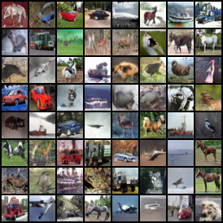
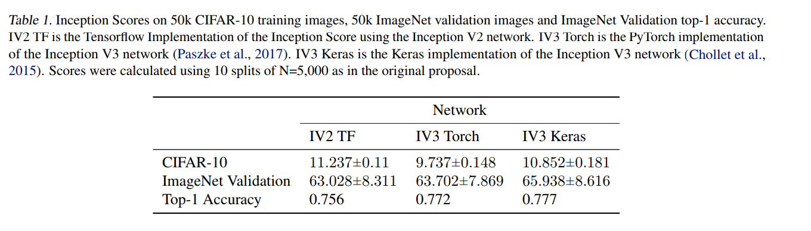

# Spectral Normalization and Projection Discriminator(Pytorch)
This project attempts to reproduce the results from "Spectral Normalization for Generative Adversarial Networks" by Takeru Miyato, Toshiki Kataoka, Masanori Koyama, Yuichi Yoshida. The Official Chainer implementation [**link**](https://github.com/pfnet-research/sngan_projection)

### Setup:
`pip install pytorch pyyaml`

### Training(cifar10):
```angular2html
python train.py --config_path configs/sn_cifar10_conditional.yml --batch_size 64
```

### Evaluation:
Inception Score:
```angular2html
python eval.py --config_path configs/sn_cifar10_conditional.yml --model_path=/path/to/model
```

Generate Samples:
```angular2html
python generate.py --config_path configs/sn_cifar10_conditional.yml --model_path=/path/to/model
```


### 32x32 Image Samples


model [download](https://drive.google.com/file/d/1SXUSAIPj2gPlKB_EzVV4_ix8X2Bn_cnn/view?usp=sharing)


### 64x64 Dog Samples


model [download](https://drive.google.com/file/d/1luHjHZnLOclmGr684FdY1sXWM7_hcIpE/view?usp=sharing)

### Notes
The Inception Score of PyTorch implementation is roughly 1.57 less than tf implementation.  The inception score of my implementation is 6.63 which is matched the claim(8.22 - 1.57) from the origin paper.
 
 from [A Note on the Inception Score](https://arxiv.org/pdf/1801.01973.pdf)

### References
- Takeru Miyato, Toshiki Kataoka, Masanori Koyama, Yuichi Yoshida. *Spectral Normalization for Generative Adversarial Networks*. ICLR2018. [OpenReview][sngans]
- Takeru Miyato, Masanori Koyama. *cGANs with Projection Discriminator*. ICLR2018. [OpenReview][pcgans]

