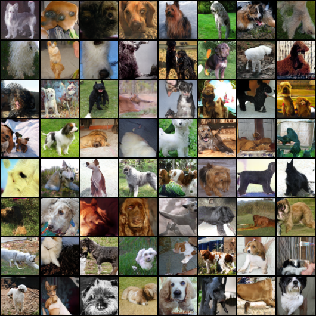

# Spectral Normalization and Projection Discriminator(Pytorch)
This project attempts to reproduce the results from "Spectral Normalization for Generative Adversarial Networks" by Takeru Miyato, Toshiki Kataoka, Masanori Koyama, Yuichi Yoshida. The Official Chainer implementation [**link**](https://github.com/pfnet-research/sngan_projection)

### Setup:
`pip install pytorch pyyaml`

### Training(cifar10):
```angular2html
python train.py --config_path configs/sn_cifar10_conditional.yml --batch_size 128
```

### Evaluation:
Inception Score:
```angular2html
python eval.py --config_path configs/sn_cifar10_conditional.yml --model_path=/path/to/model
```

Generate Samples:
```angular2html
python generate.py --config_path configs/sn_cifar10_conditional.yml --model_path=/path/to/model
```


### 64X64 Imagenet Dog Samples


model [download](https://drive.google.com/file/d/19hB1fXTOp0SNtNjGo_xSFfGXTRczvBZU/view?usp=sharing)

### References
- Takeru Miyato, Toshiki Kataoka, Masanori Koyama, Yuichi Yoshida. *Spectral Normalization for Generative Adversarial Networks*. ICLR2018. [OpenReview][sngans]
- Takeru Miyato, Masanori Koyama. *cGANs with Projection Discriminator*. ICLR2018. [OpenReview][pcgans]

